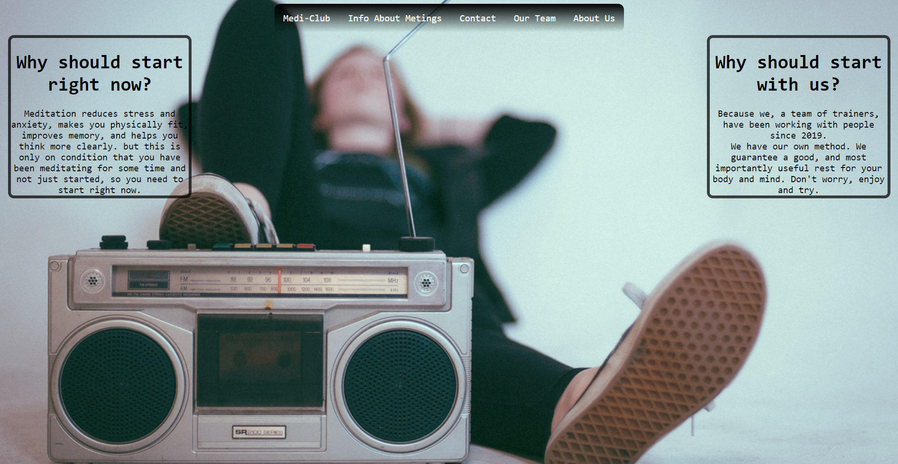
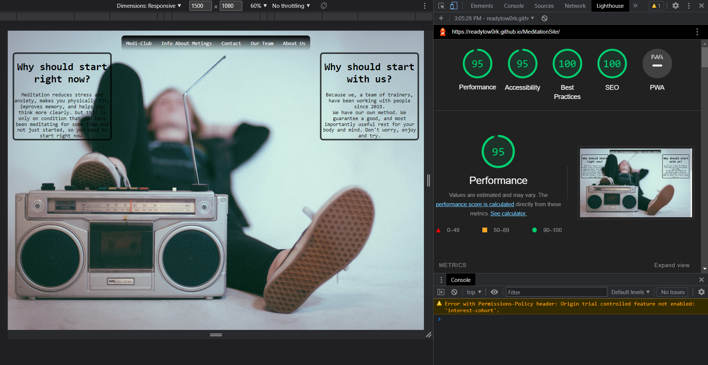

# Medi-Club
## This website introduces culture of meditation. On website You can met shedule of meditation session, our team as well links for additional information on Yotube and Wikipedia.

## Features
#

- Featured at the top of the page,the regular navigation bar with links to : Main page,Form page and page with our team. 
- The other navigation links : "Info about metings" and "About us"  just provide you to diferent parts of Main page.
- The navigation is in a font and color that contrasts the background.

## Technologies Used
# 
### Languages used
- [HTML](https://en.wikipedia.org/wiki/HTML5)
- [CSS3](https://en.wikipedia.org/wiki/CSS)

### Frameworks, Libraries & Programs Used
- [Google Fonts](https://developers.google.com/fonts)
  - Google fonts were used to import the 'Lato' and 'Oswald' font into the style.css file which is used on all pages throughout the project.
- [Visual Studio](https://code.visualstudio.com/updates/v1_74) VS were used for comfortoble typing a code.
- [Git](https://git-scm.com/)
  - Git was used for version control by utilizing the Gitpod terminal to commit to Git and Push to GitHub.
- [GitHub](https://github.com/)
  - GitHub is used to store the projects code after being pushed from Git.
- [Unsplash](https://unsplash.com/) Were used for download photo.

#

## Testing
- I tested that this page works in different browsers : Chrome, Firefox and Safari
- I confirmed that the navigation, header, about, services and contact pages all have readable texts and are easy to understand.
- I have confirmed that the form works correctly validating all input elements and the submit button works.

### Bugs

#### Solved bugs
- When I tested my web pages with lighthouse I discovered that the upload time of the pages was very slow.
- I discovered that this was due to the size of the images.
- Reducing the size  fixed the problem.
- Button "Submit" need extra attention for excelent view.

### Validator Testing
- HTML
  - Have some errors like : Duplicate attribute,No space between attributes, but everything work. [W3C validator](https://validator.w3.org)

- CSS
  - I have a couple errors with gradients in code, but gradient work correct. [CSS Valdation Service](https://jigsaw.w3.org/css-validator/)
 

## Google Developer Tools
- I made use of the built-in **Chrome Dev Tools** to experiment and debug while coding, in addition to testing simulated responsive behaviour across a wide range of mobile and desktop devices, and finally checking all pages Performance using **Lighthouse**.

- Accessibility
  - I confirmed that the colors and fonts chosen are easy to read accessible by running through lighthouse in devtools.

### Unfixed Bugs
- Image in First page (in header) not adobt for different resolution overall everything  adobt bad working for any resolution except desktop resolution.

# Deployment
- The site was deployed to Github pages. The steps to deploy are as follows: 
  - All changes you can check on this link.

   [Medi-Club](https://github.com/readytow0rk/MeditationSite)

# Content
- All content was written by the developer.
- The code with form  was adapted from another site   [Forgot Name ](https://)
- The code with gradient i take from  [Color Space](https://mycolor.space/gradient3?ori=to+right+bottom&hex=%23FFFFFF&hex2=%2346BEE0&hex3=%237E7BBB&submit=submit)

## Acknowledgments
  - My mentor for continuos useful feedback.
  - My collegues here with me for the useful advices.
  - Code Institute for enabling me to better understand css.

